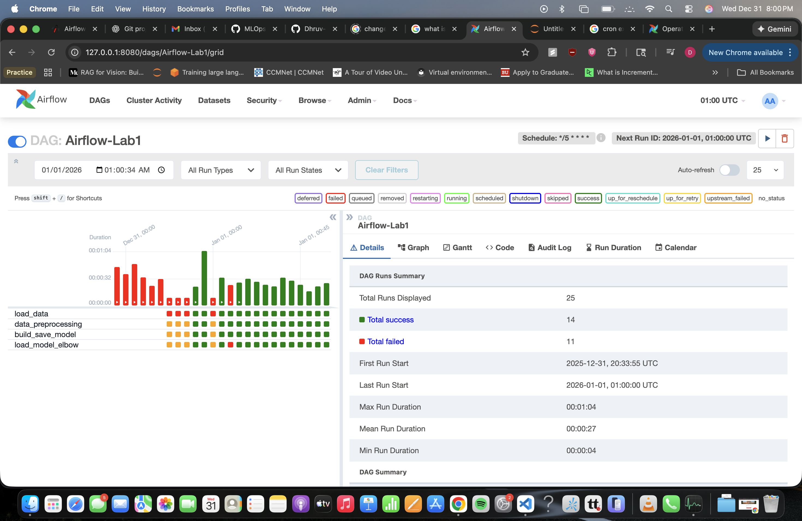

## Airflow Lab-1

This lab focuses on using airflow for data pipelines. It is used to monitor data pipelines i.e visualizing task dependencies and success/failure of tasks, output/logs of task, duration to run data pipeline(broken down by tasks)

In this simple lab, we create a pipeline(or DAG) that loads the data, performs preprocessing and perform k-means clustering to find clusters in the dataset. And it uses Airflow to vizualize each task in the pipeline. And the pipeline is scheduled to run every 5 minutes

This lab does not require installation of airflow. Airflow is installed and runned inside docker

Reference for the lab is:\
https://www.mlwithramin.com/blog/airflow-lab1
https://github.com/raminmohammadi/MLOps/tree/main/Labs/Airflow_Labs/Lab_1

To run this lab project on your machine:
```
docker-compose airflow-init

docker-compose up
```

Go to airflow dashboard and run the DAG: http://127.0.0.1:8080/
\


